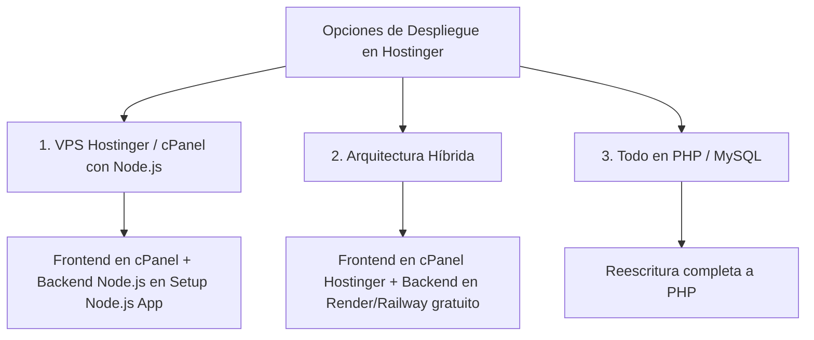

# 🌐 Análisis de Despliegue en Hostinger y Comparativa de Lenguajes (Node.js/TypeScript vs. PHP)

Este documento recopila las consideraciones técnicas, ventajas, desventajas y alternativas de arquitectura para el despliegue de **TopRival** en servidores de **Hostinger (cPanel / hPanel)**.

---

## 📊 1. Comparativa de Opciones de Backend

### Opción A: Full-Stack TypeScript / Node.js + Express (Arquitectura Actual)

El frontend de TopRival está desarrollado en **React 19 + TypeScript + Tailwind v4** y el backend en **Node.js/Express** con persistencia en **PostgreSQL**.

#### ✅ Ventajas (Pros):
1. **Ideal para Plataformas Gamer en Tiempo Real:** Permite mantener WebSockets (`Socket.io`) y Server-Sent Events para actualización inmediata de brackets y marcadores sin recargar la página.
2. **Tareas en Segundo Plano Nativas:** El worker de reglas automáticas (descalificación W.O. a los 15 minutos mediante `node-cron`) corre en memoria continuamente sin depender de cron jobs externos del sistema operativo.
3. **Mismo Lenguaje (Full-Stack):** Comparte tipos de datos e interfaces entre cliente y servidor (`types/index.ts`), reduciendo errores de integración.
4. **Escalabilidad:** Estándar moderno listo para operar en contenedores Docker, VPS, AWS, Railway o Render.

#### ❌ Desventajas / Requerimientos en Hostinger:
- En hosting compartido tradicional requiere que el cPanel incluya el módulo **"Setup Node.js App"** (CloudLinux / Phusion Passenger).
- Si el plan es el más básico sin soporte Node.js, no se puede ejecutar en el mismo servidor web tradicional sin un VPS.

---

### Opción B: Migración del Backend a PHP + MySQL

Reescritura de los endpoints de `server/server.js` a una API REST en PHP (utilizando PDO y encriptación con `password_hash` / `firebase/php-jwt`) y base de datos MySQL.

#### ✅ Ventajas (Pros):
1. **Compatibilidad Universal con Hostinger:** Funciona en el 100% de los planes de hosting compartido (incluso los más económicos) simplemente subiendo archivos a `public_html/api`.
2. **Administración Tradicional:** Creación directa de bases de datos desde phpMyAdmin / cPanel con 1 clic.
3. **Mantenimiento Automatizado por el Servidor:** Apache / LiteSpeed gestiona los procesos PHP automáticamente sin necesidad de administradores de procesos como `pm2`.

#### ❌ Desventajas (Contras):
1. **Pérdida de Procesos en Tiempo Real:** PHP se ejecuta bajo el modelo de petición/respuesta (Request-Response) y se apaga; no puede mantener sockets abiertos de forma nativa sencilla ni workers de cron en memoria.
2. **Cronjob Externo Requerido:** La regla de Walk-Over (15 min) obligaría a configurar una tarea cron en cPanel llamando a un script PHP periódicamente.
3. **Tiempo de Reescritura:** Requiere reconstruir y probar toda la lógica de autenticación JWT, registro, torneos, subida de archivos (Multer -> PHP `$_FILES`) y arbitraje.

---

## 🏗️ 2. Alternativas de Despliegue en Hostinger

### 1. Despliegue en cPanel con "Setup Node.js App" (Recomendado para Hostinger)
- **Frontend:** Se compila con `npm run build` y se sube el contenido de `dist/` a `public_html` con un archivo `.htaccess` para el enrutamiento de React.
- **Backend:** Se crea la aplicación Node.js desde la sección *Setup Node.js App* en cPanel, seleccionando `server.js` como archivo de entrada y configurando las variables de entorno.
- **Base de Datos:** PostgreSQL en la nube (ej. Neon / Supabase gratuito) o local en el servidor.

### 2. Arquitectura Híbrida (Frontend en Hostinger + Backend Cloud)
- **Frontend:** Aloja tu web comercial y aplicación React en el hosting compartido de Hostinger (`https://toprival.gg`).
- **Backend:** Aloja la API de Node.js en Render, Railway o Fly.io (`https://api.toprival.gg`), conectada a tu base de datos.
- **Ventaja:** Cero costos adicionales, máxima velocidad y sin limitaciones del hosting compartido.

---

## 🎯 3. Decisión Técnica Adoptada

Se mantiene la arquitectura **Full-Stack moderna (React + Node.js/Express + PostgreSQL/REST API)** sin modificar lenguajes, garantizando:
- Operación fluida de brackets interactivos.
- Automatización del temporizador de 15 minutos (W.O.).
- Soporte para subida de evidencias con Multer.
- Compatibilidad para despliegue tanto en cPanel (Node App) como en arquitectura híbrida / VPS.
