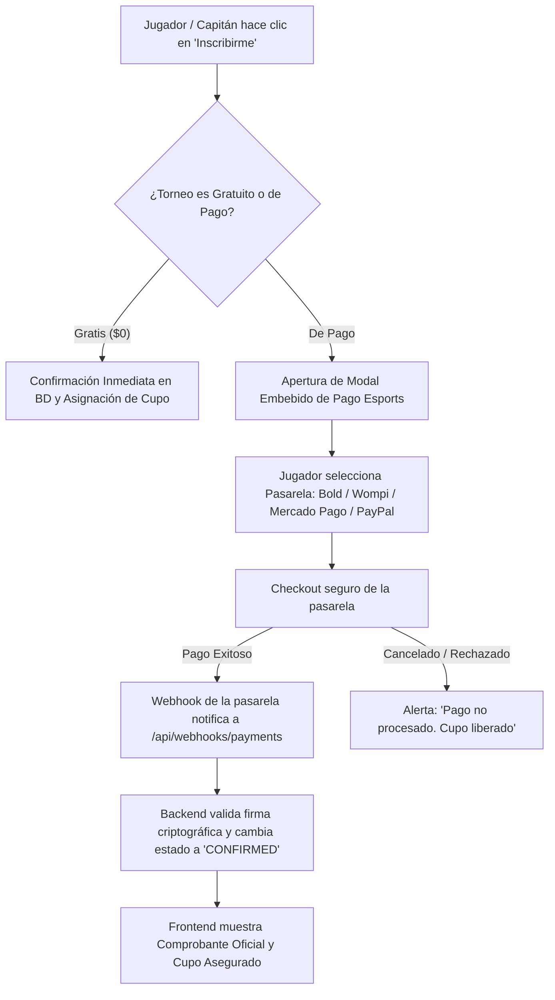
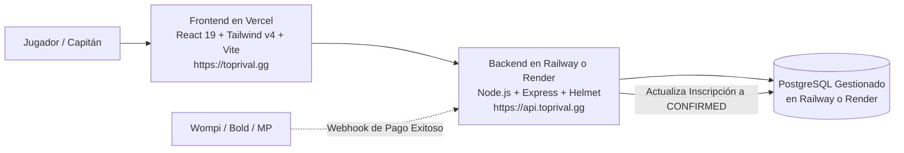

# 💳 Estrategia de Pasarelas de Pago & Estimaciones de Comisión — TopRival

Este documento recopila la arquitectura técnica del flujo de pago para inscripciones a torneos en **TopRival**, la comparativa de pasarelas de pago y las estimaciones financieras detalladas con **Bold** y **Wompi**.

---

## 🔄 1. Flujo Técnico de Inscripción y Pago

El sistema opera con validación condicional según el costo del torneo (`entryFee`), garantizando que solo los pagos confirmados mediante webhook reserven cupo en el torneo.



### Reglas de Negocio Fundamentales:
1. **Reserva Temporal de Cupo:** Cuando el usuario abre la pasarela de pago, se bloquea el cupo con un temporizador de 10 a 15 minutos en estado `WAITING_PAYMENT`. Si no se completa el pago en ese lapso, el cupo se libera automáticamente.
2. **Confirmación Exclusiva por Webhook:** El frontend jamás confirma la compra directamente; la confirmación reglamentaria la emite el servidor tras verificar la firma criptográfica enviada por la pasarela.
3. **Idempotencia:** Cada intento de pago genera una clave única (`payment_intent_id` / `reference`) para evitar cobros dobles ante reintentos de red.

---

## 📊 2. Comparativa de Pasarelas de Pago

| Pasarela | Enfoque Geográfico | Métodos Admitidos | Ventajas para TopRival | Consideraciones / Tarifas Base |
| :--- | :--- | :--- | :--- | :--- |
| **🇨🇴 Wompi** (Bancolombia) | Colombia | Nequi, Bancolombia (Botón/Transferencia), PSE, Tarjetas Débito/Crédito | Comisión más baja en Colombia, excelente tasa de aprobación en móviles y confianza de marca bancaria. | **2.65% + $700 COP** + IVA sobre la comisión. |
| **🇨🇴 Bold** | Colombia | Nequi, Daviplata, PSE, Tarjetas Débito/Crédito | API moderna, enlace de pago / checkout embebido veloz, alta adopción en el ecosistema gamer colombiano. | **2.99% + $900 COP** + IVA sobre la comisión. |
| **🌎 Mercado Pago** | LATAM (Colombia, México, Argentina, Chile, etc.) | Saldo Mercado Pago, Tarjetas, PSE/SPEI, Efectivo | Cobertura en toda América Latina; muchos gamers ya tienen fondos en su billetera digital. | **2.99% a 3.49% + tarifa fija** según el país de operación. |
| **🌍 PayPal** | Global / Internacional | Saldo PayPal, Tarjetas internacionales | Permite cobrar en USD a jugadores de cualquier país sin complicaciones cambiarias. | **5.4% + $0.30 USD** (costoso para entradas de bajo valor). |
| **⚡ Stripe** | Internacional | Apple Pay, Google Pay, Tarjetas globales | La mejor experiencia de desarrollo, pero requiere entidad legal en países soportados (EE.UU., Europa, etc.). | **2.9% + $0.30 USD**. |

---

## 💰 3. Estimaciones y Simulaciones Numéricas (Bold vs. Wompi)

A continuación se presentan tres escenarios reales de cobro de inscripción en pesos colombianos (COP), detallando el cálculo de:
- **Comisión porcentual**
- **Tarifa fija**
- **IVA (19%) sobre la comisión cobrada por la pasarela**
- **Comisión Total Descontada**
- **Monto Neto que recibe TopRival en su cuenta**

---

### 📌 Escenario A: Entrada Individual Económica ($10,000 COP)
*Ideal para torneos relámpago 1v1 (FreeFire, Clash Royale, etc.)*

#### Opción 1: Wompi (2.65% + $700 COP)
- Comisión porcentual: `$10,000 * 2.65% = $265 COP`
- Tarifa fija: `$700 COP`
- Subtotal comisión: `$265 + $700 = $965 COP`
- IVA sobre comisión (19%): `$965 * 19% = $183 COP`
- **Total descontado por Wompi:** **$1,148 COP** (~11.48% del valor)
- **Ingreso Neto para TopRival:** **$8,852 COP**

#### Opción 2: Bold (2.99% + $900 COP)
- Comisión porcentual: `$10,000 * 2.99% = $299 COP`
- Tarifa fija: `$900 COP`
- Subtotal comisión: `$299 + $900 = $1,199 COP`
- IVA sobre comisión (19%): `$1,199 * 19% = $228 COP`
- **Total descontado por Bold:** **$1,427 COP** (~14.27% del valor)
- **Ingreso Neto para TopRival:** **$8,573 COP**

> 💡 **Diferencia en Escenario A:** Con **Wompi** ahorras **$275 COP** por cada inscripción individual.

---

### 📌 Escenario B: Entrada Estándar Competitiva ($25,000 COP)
*Ideal para torneos de fin de semana o clasificatorias intermedias.*

#### Opción 1: Wompi (2.65% + $700 COP)
- Comisión porcentual: `$25,000 * 2.65% = $662.50 COP`
- Tarifa fija: `$700 COP`
- Subtotal comisión: `$662.50 + $700 = $1,362.50 COP`
- IVA sobre comisión (19%): `$1,362.50 * 19% = $258.88 COP`
- **Total descontado por Wompi:** **$1,621.38 COP** (~6.48% del valor)
- **Ingreso Neto para TopRival:** **$23,378.62 COP**

#### Opción 2: Bold (2.99% + $900 COP)
- Comisión porcentual: `$25,000 * 2.99% = $747.50 COP`
- Tarifa fija: `$900 COP`
- Subtotal comisión: `$747.50 + $900 = $1,647.50 COP`
- IVA sobre comisión (19%): `$1,647.50 * 19% = $313.03 COP`
- **Total descontado por Bold:** **$1,960.53 COP** (~7.84% del valor)
- **Ingreso Neto para TopRival:** **$23,039.47 COP**

> 💡 **Diferencia en Escenario B:** Con **Wompi** retienes **$339 COP** adicionales por cada jugador inscrito.

---

### 📌 Escenario C: Inscripción de Escuadra / Equipo ($60,000 COP)
*Cobro grupal para un equipo completo de 4 o 5 jugadores (4v4 o 5v5).*

#### Opción 1: Wompi (2.65% + $700 COP)
- Comisión porcentual: `$60,000 * 2.65% = $1,590 COP`
- Tarifa fija: `$700 COP`
- Subtotal comisión: `$1,590 + $700 = $2,290 COP`
- IVA sobre comisión (19%): `$2,290 * 19% = $435.10 COP`
- **Total descontado por Wompi:** **$2,725.10 COP** (~4.54% del valor)
- **Ingreso Neto para TopRival:** **$57,274.90 COP**

#### Opción 2: Bold (2.99% + $900 COP)
- Comisión porcentual: `$60,000 * 2.99% = $1,794 COP`
- Tarifa fija: `$900 COP`
- Subtotal comisión: `$1,794 + $900 = $2,694 COP`
- IVA sobre comisión (19%): `$2,694 * 19% = $511.86 COP`
- **Total descontado por Bold:** **$3,205.86 COP** (~5.34% del valor)
- **Ingreso Neto para TopRival:** **$56,794.14 COP**

> 💡 **Diferencia en Escenario C:** Con **Wompi** ahorras **$480.76 COP** por cada escuadra inscrita.

---

## 📊 Tabla Comparativa Resumen de Ingresos Netos

| Precio de Inscripción | Pasarela | Comisión Total + IVA | % Real Descontado | Monto Neto TopRival |
| :--- | :--- | :--- | :--- | :--- |
| **$10,000 COP** (1v1) | **Wompi** | $1,148 COP | 11.48% | **$8,852 COP** |
| $10,000 COP (1v1) | **Bold** | $1,427 COP | 14.27% | **$8,573 COP** |
| **$25,000 COP** (Individual/Dúo) | **Wompi** | $1,621 COP | 6.48% | **$23,379 COP** |
| $25,000 COP (Individual/Dúo) | **Bold** | $1,961 COP | 7.84% | **$23,039 COP** |
| **$60,000 COP** (Escuadra 4v4/5v5) | **Wompi** | $2,725 COP | 4.54% | **$57,275 COP** |
| $60,000 COP (Escuadra 4v4/5v5) | **Bold** | $3,206 COP | 5.34% | **$56,794 COP** |

---

## 🏗️ 4. Estructura de Base de Datos Necesaria para la Fase de Desarrollo

Cuando iniciemos la implementación técnica, añadiremos la tabla `payments` al esquema relacional:

```sql
CREATE TABLE IF NOT EXISTS tournament_payments (
    id UUID PRIMARY KEY DEFAULT uuid_generate_v4(),
    tournament_id UUID REFERENCES tournaments(id) ON DELETE CASCADE,
    user_id UUID REFERENCES users(id) ON DELETE CASCADE,
    team_id UUID REFERENCES teams(id) ON DELETE SET NULL,
    gateway VARCHAR(50) NOT NULL, -- 'WOMPI', 'BOLD', 'MERCADOPAGO', 'PAYPAL'
    transaction_reference VARCHAR(255) UNIQUE NOT NULL,
    gateway_transaction_id VARCHAR(255),
    amount_in_cents BIGINT NOT NULL, -- Ej: 2500000 para $25,000 COP
    currency VARCHAR(10) DEFAULT 'COP',
    fee_in_cents BIGINT DEFAULT 0,
    net_amount_in_cents BIGINT DEFAULT 0,
    payment_method_type VARCHAR(50), -- 'NEQUI', 'CARD', 'PSE', 'BANCOLOMBIA'
    status VARCHAR(50) DEFAULT 'PENDING', -- 'PENDING', 'APPROVED', 'DECLINED', 'VOIDED', 'ERROR'
    created_at TIMESTAMP WITH TIME ZONE DEFAULT NOW(),
    updated_at TIMESTAMP WITH TIME ZONE DEFAULT NOW()
);
```

---

## 🎯 5. Recomendación Técnica para TopRival

1. **Para Operación en Colombia:**
   - **Wompi** es la opción numéricamente superior: comisiones más bajas (2.65% + $700 vs 2.99% + $900), conexión directa con Nequi y transferencias Bancolombia sin comisión adicional para los usuarios.
   - **Bold** es una excelente segunda alternativa si buscas una activación inmediata sin tantos requisitos corporativos iniciales.
2. **Estrategia de Precios sugerida:**
   - En torneos de bajo valor ($10,000 COP), la tarifa fija impacta más (~11% a 14%).
   - Se recomienda cobrar un mínimo de **$15,000 COP** para entradas individuales o trasladar un pequeño costo de servicio (ej. "Tarifa de inscripción: $10,000 + $1,000 tarifa de procesamiento").

---

## 🚀 6. Viabilidad y Compatibilidad en Despliegue con Railway

**¿Funciona el canal de pago en un despliegue con Railway?**
**Sí, al 100%. De hecho, Railway es uno de los mejores entornos cloud para pasarelas de pago y webhooks.**

### Ventajas Técnicas Clave de Usar Railway para Pagos:
1. **Dominio HTTPS / SSL Automático y Válido:**
   - Pasarelas como Wompi, Bold y Mercado Pago exigen estrictamente que los endpoints de **Webhooks** (`/api/webhooks/payments`) corran bajo protocolo HTTPS seguro. Railway genera dominios públicos SSL automáticos (ej. `https://toprival-api.up.railway.app`) y permite vincular dominios propios (`https://api.toprival.gg`) sin costo extra.
2. **Proceso Continuo en Línea (Zero Cold Starts):**
   - A diferencia de plataformas serverless (como Vercel Serverless Functions o AWS Lambda) que pueden "dormir" o tener retrasos de arranque (*cold starts*), en Railway tu servidor Node.js/Express corre continuamente 24/7. Esto asegura que ningún webhook de pago se pierda o sufra *timeout*.
3. **Manejo Seguro de Secretos Criptográficos:**
   - Las variables de entorno críticas (`WOMPI_PUBLIC_KEY`, `WOMPI_PRIVATE_KEY`, `WOMPI_INTEGRITY_SECRET`, `BOLD_API_KEY`, etc.) se configuran de forma encriptada en el panel de Railway sin exponerlas en repositorios ni en el bundle del cliente.
4. **Base de Datos PostgreSQL en Red Privada:**
   - Al alojar PostgreSQL y la API en Railway dentro del mismo proyecto, se comunican por red interna (`internal private network`) con latencia inferior a 2 milisegundos, garantizando que el cambio de estado de la inscripción a `CONFIRMED` y la asignación del cupo sea instantánea tras recibir el pago.

---

## 🌐 7. Arquitectura Cloud Recomendada: Vercel + Railway / Render



- **Frontend (Vercel):** Velocidad extrema en Edge CDN global, SSL automático y soporte nativo para Single Page Applications (SPA).
- **Backend (Railway / Render):** Procesos continuos 24/7 sin suspensión (*no cold-starts*), permitiendo que el worker de W.O. (15 min) y los webhooks de pago se ejecuten en tiempo real.
- **Base de Datos (PostgreSQL en Railway):** Integrada, respaldada automáticamente y accesible por red privada de ultra baja latencia.

---

## 📦 8. Estrategia de Repositorios: ¿Monorepo o Repositorios Separados?

### Opción A: Monorepo (Un Solo Repositorio con `/` y `/server`) — **Recomendada para TopRival**
Mantener el proyecto tal como está estructurado actualmente (Frontend en la raíz y Backend en la carpeta `server/`).

#### ✅ Ventajas:
1. **Soporte Nativo en Vercel y Railway:**
   - **En Vercel:** Al conectar el repositorio de GitHub, en la configuración de proyecto simplemente seleccionas **Root Directory = `./`** (raíz). Vercel detecta automáticamente Vite y compila el frontend.
   - **En Railway:** Al conectar el mismo repositorio de GitHub, en la configuración de servicio seleccionas **Root Directory = `server`**. Railway detecta automáticamente el `package.json` de Node.js y levanta la API.
2. **Un Solo Historial de Commits:** Puedes sincronizar cambios de frontend y backend juntos (por ejemplo, si agregas un nuevo campo al modelo de datos o ajustas un endpoint de pago, se versiona en el mismo commit).
3. **Mantenimiento Simplificado:** No tienes que gestionar múltiples permisos de repositorios en GitHub.

---

### Opción B: Repositorios Independientes (`toprival-front` y `toprival-back`)

Dividir el código en dos proyectos de Git completamente independientes.

#### ✅ Ventajas:
1. **Despliegues 100% Desacoplados:** Un push al backend solo reconstruye el backend; un cambio estético en el frontend solo dispara el build de Vercel.
2. **Permisos Granulares:** Si en el futuro incorporas desarrolladores externos solo para diseño o solo para backend, puedes dar acceso únicamente a un repositorio.

#### ❌ Desventajas:
- Duplica la gestión de repositorios, branches, PRs y sincronización de tipos TypeScript compartidos.

---

### 🎯 Decisión y Recomendación:
Para la etapa actual de **TopRival**, la **Opción A (Monorepo)** es la más eficiente, rápida y fácil de gestionar:
- **Vercel** apunta a la raíz `./`
- **Railway** apunta al directorio `server`
Ambos servicios soportan esta configuración de forma nativa con solo 1 clic en sus paneles.


